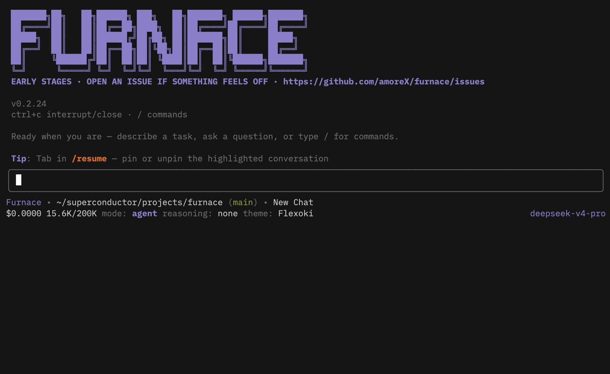

# Furnace

Furnace is a terminal-first coding agent with a real TUI, typed tools, permission gates, saved session history, and both interactive and headless workflows.

It is built for working on actual repositories, not toy demos.



## Why Furnace

- **A terminal UI that feels like a product.** Furnace is not just a prompt loop in a shell. It has a dedicated interface, multiple layouts, model controls, and an editing flow built for long sessions.
- **Real tools with real guardrails.** The agent can read, search, edit, write, and run shell commands, but risky actions go through permissions instead of happening silently.
- **Sessions you can come back to.** Chats are stored locally, resumable, forkable, and designed for ongoing work instead of one-off prompts.
- **Interactive when you want it, headless when you do not.** Use the TUI for active coding sessions or run one-shot prompts from the CLI.
- **Built to help with implementation, not just chatting.** Plan mode, subagents, skills, image input, and repository indexing are all there to make the agent more useful inside a real codebase.

## Install

Requirements:

- Node.js 22.x
- A provider API key configured through `/login` or environment variables

Install from npm:

```bash
npm install -g cook-furnace
```

The package name is `cook-furnace`, and the installed command is `furnace`.

## Quickstart

Start the TUI:

```bash
furnace
```

Then use `/login` to choose a provider and save an API key.

Run from source:

```bash
npm install
npm run dev
```

Run a one-shot prompt:

```bash
npm run dev -- -p "Summarize this repository"
```

Build the compiled CLI:

```bash
npm run build
npm run start -- --help
```

## Standout Features

### Interactive TUI

Furnace ships with a keyboard-first terminal UI instead of pretending a raw REPL is enough. You can switch layouts, inspect state, browse models, and stay inside a focused coding workflow.

### Safe file and shell access

The agent has typed tools for files, search, web access, and shell commands. Mutating actions are permission-gated, and the workflow is designed to be usable on real repositories without blind trust.

### Long-running session workflow

Furnace keeps local session history in `.furnace/`, supports resume and forks, and is built for ongoing agent work instead of disposable chats.

### More than chat

It supports plan mode, subagents, image attachments, custom skills, and headless CLI usage, so the same tool can handle exploration, implementation, and automation.

## Learn More

- [DOCS.md](DOCS.md) for architecture and contributor documentation
- [CHANGELOG.md](CHANGELOG.md) for release history
- [CONTRIBUTING.md](CONTRIBUTING.md) for contribution guidance

## Status

Furnace is early, but it is already a usable local coding-agent CLI with interactive and headless modes.

