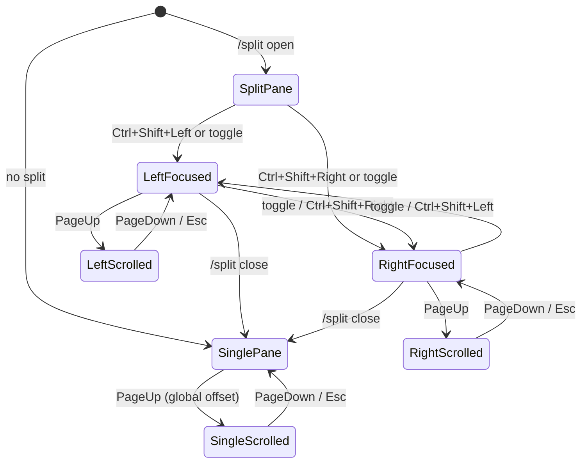

# feat: TUI split-pane scrollback and keyboard navigation

## Goal Capsule

Make the beta `/split` side-by-side chat TUI easy to scroll and navigate with the keyboard. The existing split session model (focusing a pane swaps which session is active in the input area) stays unchanged. The work is done when a focused pane can be scrolled with PageUp/PageDown, each pane remembers its own scroll position, and there are direct keyboard shortcuts to focus the left or right pane.

**Authority:** preserve the current session-swap behavior; do not rearchitect how split sessions are created or closed.

**Stop conditions:** per-pane scrollback works, directional focus shortcuts work, hints and docs are updated, and `npm run typecheck` and `npm test` pass.

---

## Product Contract

### Summary

The `/split` beta feature renders two fixed-height panes inside the Ink TUI. Each pane uses `LiveChat` with a manual scrollback window, but the app only has one global `scrollbackOffset` and the PageUp/PageDown handler computes its maximum from the main chat's line count. That means split-pane scrolling does not track the focused pane and can appear stuck or jump unpredictably. Navigation is also limited to a single `Ctrl+K` toggle that only fires when focus is already outside the input. This plan adds per-pane scrollback offsets, direct left/right focus shortcuts, and clearer visual feedback.

### Problem Frame

1. **Scrollback is global, not per-pane.** The `UiState` has a single `scrollbackOffset`. In split mode, `SplitChatView` passes that same offset to whichever pane is active, but the PageUp/PageDown handler computes `maxOffset` from `state.committedLines.length` (the main chat). The active pane may have far fewer or far more lines, so the scroll feels wrong or stops early.
2. **Scroll position is lost on pane switch.** Because there is only one offset, focusing the other pane carries the old scroll position with it. There is no way to scroll the left pane independently from the right pane.
3. **Navigation shortcut is incomplete.** The hint bar says `Ctrl+K toggle split`, but the input handler only triggers the toggle when `state.focus !== "input"`. When the input is focused, `Ctrl+K` falls through to the task toggle (or does nothing), which contradicts the hint and makes pane switching harder.
4. **No direct left/right focus.** Users can only toggle; there is no shortcut to jump directly to the left or right pane.
5. **No visual scrollback cue in split panes.** The main chat shows a `Viewing scrollback` line, but split panes do not, so it is unclear when a pane is scrolled back.

Terminal mouse *hover* detection is not reliably available across terminals, so this plan does not rely on it. Mouse wheel events can be read from the terminal in supporting emulators, but that requires enabling terminal mouse tracking and parsing raw ANSI sequences outside Ink; it is deferred to follow-up work.

### Requirements

R1. In split mode, the PageUp and PageDown keys scroll the currently focused pane by its visible page size, computed from that pane's line count and its own scrollback offset.

R2. Each pane retains its own scrollback offset when focus switches between left and right panes.

R3. `Escape` returns the focused pane to live content (offset 0) when that pane is scrolled back.

R4. Single-pane chat behavior is unchanged: the existing global `scrollbackOffset` and PageUp/PageDown/Escape controls continue to work for the normal chat view.

R5. `Ctrl+K` reliably toggles split-pane focus whenever a split is open, matching the existing hint bar text.

R6. New directional shortcuts (`Ctrl+Shift+Left` and `Ctrl+Shift+Right`) focus the left or right pane directly without requiring repeated toggles.

R7. The hint bar and `docs/interaction-model.md` accurately describe the split-mode navigation and scroll controls.

R8. A focused pane shows a concise visual cue when it is scrolled back, similar to the main chat's `Viewing scrollback` line.

### Scope Boundaries

**In scope:**
- `src/ui/ink-terminal.tsx`: `UiState` scrollback fields, `FurnaceApp` input handler, `SplitChatView`/`SplitPaneView` rendering, and split pane data computation.
- `src/interactive-session-controller.ts`: adding a side-specific split-focus callback so the UI can request left/right focus directly.
- `docs/interaction-model.md`: update the Split Mode Beta section to describe the new controls.
- `test/smoke.test.mjs`: update or add tests for split-pane scrollback behavior.

**Deferred to Follow-Up Work:**
- Mouse wheel scrolling via terminal mouse tracking (possible but requires raw ANSI input handling outside Ink and is not universally supported).
- Scroll position persistence across Furnace restarts.
- Split pane width/height customization or resizing.

**Out of scope:**
- Changes to how split sessions are created, closed, or swapped.
- Changes to the main chat's native terminal scroll model (already addressed by the prior `Static`-based scroll plan).
- Non-TUI surfaces (headless, JSON output, etc.).

---

## Planning Contract

### Key Technical Decisions

KTD1: **Per-pane scrollback offsets stored in `UiState` as `splitScrollbackLeft` and `splitScrollbackRight`.** A single global offset cannot represent two independent panes. Two numeric fields keep the model simple and aligned with the visual left/right layout, even though sessions may swap sides when focus changes. The normal chat keeps its existing `scrollbackOffset` for non-split mode.

KTD2: **Extract a shared `getSplitPane(state, side, columns, rows)` helper.** Both the scroll handler in `FurnaceApp` and the `SplitChatView` component need to know which pane is on which side and how many lines it contains. A single helper prevents the two code paths from computing pane data differently and drifting out of sync.

KTD3: **Add `onSplitFocus?: (side: "left" | "right") => void` to `CreateFurnaceTerminalOptions`.** The directional shortcuts need a way to request a specific pane. The existing `onSplitToggle` only toggles; a side-specific callback is the smallest API change and can be implemented in `interactive-session-controller.ts` by calling `focusSplitSide(side)` directly.

KTD4: **Keep the session-swap model as-is.** When a user focuses the pane that currently contains the split session, `focusSplitSide` swaps the active and split sessions. This is existing behavior and the user confirmed it should stay. The plan only changes how focus and scrollback are tracked, not the session model.

KTD5: **No custom mouse input handling in this plan.** Mouse hover cannot be reliably detected in terminals. Mouse wheel detection is possible in supporting terminals but requires enabling `xterm` mouse tracking (`CSI ?1003 h` / `?1006 h`) and parsing raw stdin escape sequences alongside Ink's `useInput`. That is kept out of scope to keep the first iteration keyboard-first and robust.

### High-Level Technical Design

The `FurnaceApp` input handler now has two branches:

1. **Single-pane branch:** unchanged, uses `state.scrollbackOffset` and `state.committedLines.length`.
2. **Split-pane branch:** active when `state.splitPane` is set. It reads `state.splitPane.activeSide`, computes the active pane via `getSplitPane`, and uses that pane's `committedLines` length and the side-specific offset (`splitScrollbackLeft` or `splitScrollbackRight`) for PageUp, PageDown, and Escape.

`SplitChatView` renders each pane by passing the side-specific offset to `SplitPaneView`, which forwards it to `LiveChat`. `LiveChat` already supports `scrollbackOffset`; no change to its scrollback math is needed.

### Assumptions

- The terminal emulator supports `Ctrl+Shift+Left/Right` as distinct control chords. This is true in most modern terminals; if a terminal remaps those chords, the directional shortcuts degrade to the existing `/split left` / `/split right` slash commands.
- Users are comfortable with keyboard-first split navigation. Mouse wheel support is explicitly deferred.
- Pane dimensions derived from `useWindowSize()` are stable enough for scrollback page sizing; rapid resizes may briefly misalign the offset but will not crash.

### Risks & Dependencies

- **Risk: `Ctrl+K` conflict with task toggle.** The current task toggle also listens for `Ctrl+K` when tasks are present. Removing the `state.focus !== "input"` guard from the split toggle means `Ctrl+K` will toggle split focus whenever a split is open, even if tasks are running. `Ctrl+T` already toggles tasks, so the loss is only the `Ctrl+K` task shortcut in split mode. The hint bar already shows `Ctrl+K toggle split` in split mode and `Ctrl+K tasks` only when no split is open, so this change aligns behavior with the hint. Mitigation: ensure the split-mode hint does not mention `Ctrl+K tasks` and that the docs point users to `Ctrl+T` for tasks in split mode.
- **Risk: focus state ambiguity.** `UiState.focus` does not model split-pane focus directly; split focus is tracked via `splitPane.activeSide`. The input handler must check both `state.splitPane` and `state.splitPane.activeSide` to decide which pane to scroll. Mitigation: use the shared `getSplitPane` helper in both the renderer and the input handler so the active-side logic is not duplicated.
- **Risk: per-side offsets vs. per-session offsets.** Because sessions swap sides when focus changes, a side-based offset will follow the visual pane rather than the conversation. If a user expects each conversation to remember its own scroll position, this model will feel wrong. The user confirmed the session-swap model stays, so side-based offsets are the right choice; per-session offsets would require deeper controller changes and are out of scope.
- **Dependency: Ink continues to render `LiveChat` with the same `scrollbackOffset` contract.** The plan relies on `LiveChat` accepting and honoring `scrollbackOffset` and `maxLines`. No Ink upgrade is planned; if Ink is upgraded, verify the `LiveChat` contract still holds.

### Sources & Research

- Local repo: `src/ui/ink-terminal.tsx` — current `SplitChatView`, `SplitPaneView`, `LiveChat`, `FurnaceApp` input handler, and `UiState`/`UiStore` definitions.
- Local repo: `src/interactive-session-controller.ts` — `focusSplitSide`, `onSplitToggle`, and `/split` command handling.
- Local repo: `docs/interaction-model.md` — existing Split Mode Beta documentation.
- External: Ink 7.1.0 does not expose mouse input APIs; mouse wheel/hover support would require raw terminal ANSI input handling outside of Ink.

---

## Implementation Units

### U1. Extract shared split-pane data helper

**Goal:** Give both the scroll handler and the renderer a single function that computes left/right pane content and dimensions.

**Requirements:** R1, R2

**Dependencies:** none

**Files:**
- `src/ui/ink-terminal.tsx`

**Approach:**
- Create a helper near `SplitChatView` that takes `state`, `columns`, and `rows` and returns `{ leftPane, rightPane, paneWidth, paneHeight }` matching the data currently built inline in `SplitChatView`.
- `leftPane` and `rightPane` should be objects that include `committedLines`, `scrollbackOffset`, `active`, `width`, `height`, and the existing `SplitPaneSummary` fields.
- Update `SplitChatView` to use this helper so its JSX only consumes the returned values.

**Patterns to follow:** Keep the existing pane computation logic (main pane on the opposite side of `splitPane.side`, preview pane on the `splitPane.side`, etc.) and only move it into a callable function.

**Test scenarios:**
- Test expectation: none — this is a pure refactor; correctness is covered by U2 and manual smoke testing.

**Verification:** The app still renders split mode identically; `npm run typecheck` passes after the move.

---

### U2. Add per-pane scrollback offsets and fix split-mode scroll handler

**Goal:** PageUp/PageDown/Escape scroll the focused pane by its own line count and offset.

**Requirements:** R1, R2, R3, R4

**Dependencies:** U1

**Files:**
- `src/ui/ink-terminal.tsx`
- `test/smoke.test.mjs`

**Approach:**
- Add `splitScrollbackLeft: number` and `splitScrollbackRight: number` to `UiState`, initialized to `0` in `UiStore`. Do not reset them on focus changes; each pane keeps its offset until the split closes.
- Reset both per-pane offsets to `0` in `clearTranscriptDisplay()` alongside the existing `scrollbackOffset: 0` reset, and in the `setSplitPane` implementation when it receives `undefined` (split closed). Do not reset them in `clearViewport()`, which only clears the screen.
- In `FurnaceApp`'s `useInput` handler, add a split-mode branch that fires when `state.splitPane` is set and the key is PageUp, PageDown, or Escape.
- Use `getSplitPane(state, columns, rows)` to determine the active pane and its `committedLines`.
- Compute `pageSize` from the active pane's visible line budget (matching the value `LiveChat` receives via `maxLines`).
- Compute `maxOffset` from `maxScrollbackOffset(paneCommittedLines.length, pageSize)`.
- Update the side-specific offset field (`splitScrollbackLeft` or `splitScrollbackRight` based on `state.splitPane.activeSide`) with the same clamping logic used for the single-pane offset.
- Leave the single-pane branch unchanged, using `state.scrollbackOffset` and `state.committedLines.length`.
- Update `SplitChatView` to pass the side-specific offset (`splitScrollbackLeft`/`splitScrollbackRight`) to each pane instead of the global `state.scrollbackOffset`.

**Patterns to follow:** Reuse the existing `scrollbackPageSize`, `maxScrollbackOffset`, and `scrollbackWindow` helpers; do not duplicate their math.

**Test scenarios:**
- Happy path: in split mode, pressing PageUp increases the active pane's offset by one page and the pane shows earlier lines.
- Happy path: pressing PageDown decreases the active pane's offset and stops at 0.
- Edge case: pressing Escape when the active pane is scrolled back resets that pane's offset to 0.
- Edge case: switching focus with Ctrl+K or Ctrl+Shift+Left/Right preserves the previously active pane's offset and applies the newly active pane's stored offset.
- Edge case: `maxOffset` is computed from the active pane's `committedLines` length, not the main chat's `committedLines` length.
- Error path: no runtime error when a pane has fewer lines than its page size (offset clamps to 0).

**Verification:** Manual split-mode smoke test: open a split, generate enough content in both panes, scroll each pane independently, switch focus, and verify offsets are preserved. `npm run typecheck` and `npm test` pass.

---

### U3. Fix and extend split navigation shortcuts

**Goal:** Make `Ctrl+K` reliably toggle split focus and add direct left/right focus shortcuts.

**Requirements:** R5, R6, R7

**Dependencies:** U2

**Files:**
- `src/ui/ink-terminal.tsx`
- `src/interactive-session-controller.ts`
- `docs/interaction-model.md`

**Approach:**
- Make the `Ctrl+K` split toggle canonical at the `FurnaceApp` level. Remove the `onSplitToggle` prop from `PromptInput` (or leave it unset) so the top-level `useInput` handler is the only place that toggles split focus. Then remove the `state.focus !== "input"` guard from the `Ctrl+K` handler in `FurnaceApp` so it fires whenever `state.splitPane` is set.
- Add `onSplitFocus?: (side: "left" | "right") => void` to `CreateFurnaceTerminalOptions` and expose it as `store.splitHandlers.onFocus`.
- In `interactive-session-controller.ts`, implement `onSplitFocus` by calling `focusSplitSide(side)` if `splitSessionId` is set.
- Add `Ctrl+Shift+Left` and `Ctrl+Shift+Right` handlers in `FurnaceApp` that call `store.splitHandlers.onFocus?.(side)`. If the requested side is already active, do nothing.
- Update `hintItemsForState` so the split-mode hint reads something like `Ctrl+K toggle · Ctrl+Shift+←/→ focus`.
- Update the task panel hint when a split is open: it currently says `Ctrl+K to focus`, which is misleading because `Ctrl+K` toggles split focus. Change it to a different focus affordance (e.g., `Up to focus`) or hide the `Ctrl+K` hint in split mode.
- Update `docs/interaction-model.md` Split Mode Beta section to document the new controls.

**Patterns to follow:** Match the existing `onSidebarToggle` / `onTaskBackground` callback pattern in `CreateFurnaceTerminalOptions` and `UiStore`.

**Test scenarios:**
- Happy path: `Ctrl+K` toggles split focus even when the input is focused.
- Happy path: `Ctrl+Shift+Left` focuses the left pane; `Ctrl+Shift+Right` focuses the right pane.
- Edge case: pressing the shortcut for the already-active pane is a no-op.
- Edge case: when no split is open, the new shortcuts do nothing and do not interfere with other controls.
- Integration: the hint bar reflects the new shortcuts only when a split is open.

**Verification:** Manual smoke test in split mode: focus input, press Ctrl+K to toggle; press Ctrl+Shift+Left/Right to jump directly; confirm the active pane highlight follows. Typecheck and tests pass.

---

### U4. Ensure scrollback visual cue appears in the focused split pane

**Goal:** Confirm that the existing scrollback cue is visible when a split pane is scrolled back, and add a pane-level indicator only if `LiveChat`'s cue is insufficient.

**Requirements:** R8

**Dependencies:** U2

**Files:**
- `src/ui/ink-terminal.tsx`

**Approach:**
- `LiveChat` already renders a `Viewing scrollback — PageDown or Esc returns to live` cue when `scrollbackOffset > 0`. Once U2 passes the side-specific offset to `SplitPaneView`, the active pane should automatically display this cue.
- Visually inspect the split pane after scrolling. If the cue is hard to notice inside the bordered pane (e.g., it blends into the live region), add a one-line muted-foreground cue in `SplitPaneView` above the `LiveChat` content when the pane's offset is greater than 0. If the existing `LiveChat` cue is sufficient, no new rendering is needed.
- Avoid duplicating the cue if `LiveChat` already shows it clearly.

**Patterns to follow:** Reuse the same muted-foreground text style used by the main chat scrollback cue.

**Test scenarios:**
- Happy path: the focused pane shows a scrollback cue when `scrollbackOffset > 0`.
- Edge case: the cue disappears when the pane's offset returns to 0.
- Edge case: the inactive pane does not show a stale cue when it is not scrolled back (its offset is 0).

**Verification:** Visual inspection in split mode after scrolling one pane up; typecheck and tests pass.

---

### U5. Tests and documentation

**Goal:** Keep the test suite aligned and update user-facing docs.

**Requirements:** R7

**Dependencies:** U2, U3, U4

**Files:**
- `test/smoke.test.mjs`
- `docs/interaction-model.md`

**Approach:**
- In `test/smoke.test.mjs`, add or update tests that exercise the split-pane scrollback helpers:
  - `maxScrollbackOffset` and `scrollbackWindow` with small line counts (edge case already partially covered by the existing windowing tests; ensure they still pass).
  - If the extracted `getSplitPane` helper is exported, add a unit test that verifies it returns the correct pane for left/right and maps the correct `committedLines` and active flag.
  - Automated UI-level tests for `SplitChatView` offset wiring are optional; if the current smoke harness does not render the full Ink tree, cover this with the manual smoke test in the Verification Contract instead.
- Remove or update any assertions that assume a single global scrollback offset is always used for split mode.
- Update `docs/interaction-model.md` Split Mode Beta section to list the new controls clearly:
  - `Ctrl+K` toggles focus between panes.
  - `Ctrl+Shift+Left` / `Ctrl+Shift+Right` focus the left or right pane directly.
  - `PageUp` / `PageDown` scroll the focused pane.
  - `Esc` returns the focused pane to live content.

**Patterns to follow:** Match the existing docs style and the existing smoke test patterns around `buildTranscriptLinesForTest` and `LiveChat` exports.

**Test scenarios:**
- Happy path: `npm test` passes after the windowing test updates.
- Happy path: docs render correctly and describe the new controls.

**Verification:** `npm run typecheck && npm test` is green.

---

## Verification Contract

| Gate | Command | Applies to |
|---|---|---|
| Typecheck | `npm run typecheck` | All units |
| Test suite | `npm test` | All units |
| Manual smoke | Open a split, generate content in both panes, scroll each pane independently, switch focus, verify offsets and cues | U2, U3, U4 |
| Docs review | Read `docs/interaction-model.md` Split Mode Beta section | U5 |

## Definition of Done

- `UiState` has independent `splitScrollbackLeft` and `splitScrollbackRight` fields, and the single-pane `scrollbackOffset` still works outside split mode.
- The `FurnaceApp` input handler scrolls the focused pane in split mode using that pane's line count and offset.
- `Ctrl+K` toggles split focus whenever a split is open, even when the input is focused.
- `Ctrl+Shift+Left` and `Ctrl+Shift+Right` focus the left and right panes directly.
- The focused pane shows a scrollback cue when offset is greater than 0.
- `docs/interaction-model.md` documents the new controls.
- `npm run typecheck` and `npm test` pass.
- No regressions in single-pane chat scrolling or in the existing split open/close behavior.
