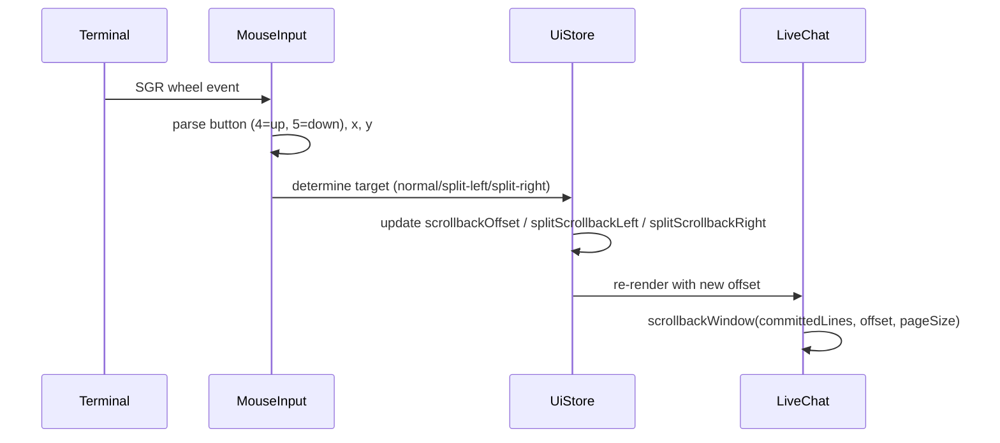

# feat: TUI mouse-wheel scroll for in-view chat

## Goal Capsule

Make the Furnace TUI scrollable with the mouse wheel inside the app itself. The terminal is already fixed to full screen height with the input and status bar pinned at the bottom. The chat region occupies the remaining space. Wheel events inside the chat region scroll history, respecting left/right split panes when a split is open. Mouse support is on by default; users can opt out with `/mouse off` or `FURNACE_MOUSE=0`.

**Stop conditions:** wheel scrolling works in normal and split chat, `/mouse` toggles support, opt-out works, and `npm run typecheck` / `npm test` pass.

---

## Product Contract

### Summary

The current in-view scroll model uses `PageUp`/`PageDown` to move the `scrollbackOffset`. The user wants a mouse-first scroll experience like Hermes and OpenCode, where the terminal captures wheel events and the TUI scrolls internally. This requires enabling terminal mouse tracking, parsing the raw wheel events, and updating the existing scroll offset fields directly. `PageUp`/`PageDown` are removed from chat scroll.

### Problem Frame

1. **No mouse wheel input.** Ink's `useInput` does not expose mouse events. The app currently has no raw stdin parser for wheel escape sequences.
2. **Terminal mouse tracking is off by default.** Modern terminals support xterm mouse modes (`1000`/`1006`), but they must be enabled explicitly.
3. **Mouse capture conflicts with terminal selection.** Enabling mouse tracking can break tmux/screen scrollback and terminal-native text selection. Hermes and OpenCode both settled on opt-in or toggleable defaults to manage this.
4. **No runtime toggle.** Users need a quick way to turn mouse support on or off without restarting.

### Requirements

R1. Mouse wheel events scroll the chat view when the cursor is over the chat region. Up scrolls back in history; down scrolls toward live content.

R2. In split mode, the X coordinate determines whether the left or right pane scrolls.

R3. Mouse wheel scrolling updates the same scrollback offset fields used by the keyboard model (`scrollbackOffset`, `splitScrollbackLeft`, `splitScrollbackRight`).

R4. `PageUp` and `PageDown` are removed from chat scroll.

R5. Mouse support is enabled by default when stdin is a TTY. It can be disabled at startup via `FURNACE_MOUSE=0` or at runtime with `/mouse off`.

R6. A `/mouse` slash command toggles mouse support at runtime (`/mouse on`, `/mouse off`, `/mouse toggle`).

R7. The app restores the terminal mouse state cleanly on exit (disables tracking).

R8. Mouse support degrades gracefully when the terminal does not emit wheel events: scrolling simply does nothing; the chat remains usable.

R9. Hints and `docs/interaction-model.md` are updated to describe mouse scrolling.

### Scope Boundaries

**In scope:**
- `src/ui/ink-terminal.tsx`: terminal setup/teardown, raw stdin mouse parser, coordinate mapping, scroll offset updates, and slash command handler wiring.
- `src/commands.ts`: add `/mouse` to slash command definitions.
- `src/interactive-session-controller.ts`: wire the `/mouse` command to a terminal callback.
- `src/ui/mouse.ts` (new): xterm mouse tracking enable/disable sequences, SGR wheel parser, and a small `MouseInput` class that emits wheel events.
- `test/smoke.test.mjs`: tests for the mouse parser.
- `docs/interaction-model.md`: update chat scroll section.

**Deferred to Follow-Up Work:**
- Click-to-focus in split panes.
- Click-to-position cursor in the input box.
- Drag-to-select text inside the TUI.
- Config persistence for the mouse setting across restarts (beyond env var).

**Out of scope:**
- Trackpad/touch-specific gestures beyond wheel emulation.
- Mouse interaction outside the chat region (panels, status bar).
- Non-TUI surfaces.

---

## Planning Contract

### Key Technical Decisions

KTD1: **Default-on mouse support with runtime opt-out.** Hermes and OpenCode both documented that default-on mouse capture can break tmux/screen selection and terminal-native scrollback. The user chose default-on with an opt-out, so the plan honors that and adds a `/mouse` command plus `FURNACE_MOUSE` env var for quick toggling.

KTD2: **Enable xterm mouse modes `1000` and `1006` at startup.** Mode `1000` enables mouse button events (including wheel), and mode `1006` enables SGR-encoded coordinates, which avoid ambiguity in large terminals and correctly report wheel events. The sequences are:
- Enable: `ESC [ ? 1000 h` and `ESC [ ? 1006 h`
- Disable: `ESC [ ? 1000 l` and `ESC [ ? 1006 l`

KTD3: **Parse wheel events in a raw `process.stdin` listener outside Ink.** Ink consumes `data` events for keyboard input. Mouse wheel events arrive as escape sequences that look like `ESC [ < button ; x ; y M` or `m` (SGR). We add a small `MouseInput` helper that listens to `stdin`, filters out SGR mouse sequences, and emits a structured `{ button, x, y, release }` event. Non-mouse data is ignored so Ink continues to receive it.

KTD4: **Map wheel events to the existing scrollback offset fields.** The existing in-view scroll model already maintains offsets and a `scrollbackWindow` function. A wheel-up event decrements the offset toward `0`; wheel-down increments it up to `maxOffset`. The mapping uses the current terminal size and the known layout of the chat region:
- Normal chat: any wheel event in the chat region (above the input/status bar) updates `scrollbackOffset`.
- Split mode: wheel events left of the vertical divider update `splitScrollbackLeft`; right of the divider updates `splitScrollbackRight`.

KTD5: **Remove `PageUp`/`PageDown` from chat scroll.** The user explicitly wants scroll-only. The handler branch that updates offsets on `PageUp`/`PageDown` is deleted.

KTD6: **No alternate screen buffer.** Hermes uses the terminal's alternate screen for a clean exit, but Furnace already operates in the main terminal scrollback. Switching to alternate screen would change the current behavior. The plan keeps the main screen, relies on mouse tracking for internal scrolling, and disables mouse tracking on exit.

### High-Level Technical Design

### Risks & Dependencies

- **Risk: terminal incompatibility.** Some terminals do not support SGR mouse mode or emit different sequences. Mitigation: wheel events that do not parse are ignored; the chat remains usable.
- **Risk: mouse capture breaks terminal selection.** This is the trade-off the user accepted. The opt-out path (`/mouse off`, `FURNACE_MOUSE=0`) mitigates it.
- **Risk: raw stdin listener conflicts with Ink.** The listener must only parse and remove SGR mouse sequences and leave other stdin data untouched. If the listener consumes non-mouse bytes, keyboard input breaks.
- **Risk: crash leaves terminal in mouse mode.** Mitigation: disable mouse tracking in `useApp().exit` hook and in `process.on('exit')`.
- **Dependency:** the in-view scroll model already implemented in `feat/tui-split-pane-scroll-navigation` must remain intact.

### Sources & Research

- Hermes TUI docs: uses `prompt_toolkit` with `mouse_support` and exposes `/mouse` command for tracking presets (`wheel`, `buttons`, `all`). Default is `all`/`on` with config toggle.
- Hermes issue #4064: documents opt-in default after discovering default-on breaks tmux/screen selection. Furnace intentionally chooses default-on per user decision.
- OpenCode CLI issue: wheel scrolling reliability in ConPTY-backed terminals; confirms OpenCode uses terminal mouse reports.
- Xterm control sequences: `CSI ? 1000 h` (mouse button tracking), `CSI ? 1006 h` (SGR mouse mode).

---

## Implementation Units

### U1. Add mouse tracking module

**Goal:** Create a reusable helper for enabling/disabling mouse tracking and parsing SGR wheel events.

**Requirements:** R1, R5, R6, R7

**Dependencies:** none

**Files:**
- `src/ui/mouse.ts`

**Approach:**
- Export `enableMouseTracking()` and `disableMouseTracking()` that write the ANSI sequences to stdout.
- Export a `MouseInput` class with:
  - `start()`: attach a `process.stdin.on('data', ...)` listener.
  - `stop()`: detach the listener.
  - `onWheel(callback: (direction: 'up' | 'down', x: number, y: number) => void)`.
- The data listener parses SGR sequences matching `ESC [ < button ; x ; y (M|m)`. Button values 4 and 5 are wheel events; M/m distinguishes release/press. Wheel events are typically emitted as release (`m`), so accept both.
- Ignore any non-matching stdin data so Ink receives it.

**Patterns to follow:** Keep the parser small and stateless; do not attempt to parse non-SGR mouse protocols.

**Test scenarios:**
- Happy path: `ESC[ < 4 ; 10 ; 5 m` parses as wheel up at (10, 5).
- Happy path: `ESC[ < 5 ; 20 ; 10 m` parses as wheel down at (20, 10).
- Edge case: malformed sequence is ignored.
- Edge case: non-mouse data passes through unchanged (we don't need to re-emit it; just don't consume it).

**Verification:** New unit test in `test/smoke.test.mjs` exercises the parser.

---

### U2. Wire mouse tracking to FurnaceApp lifecycle

**Goal:** Enable mouse tracking on app start and disable it on exit, respecting the opt-out.

**Requirements:** R5, R7, R8

**Dependencies:** U1

**Files:**
- `src/ui/ink-terminal.tsx`

**Approach:**
- Read `process.env.FURNACE_MOUSE` at startup. If it is `"0"` or `"false"`, mouse support starts disabled.
- In `FurnaceApp`, initialize a `MouseInput` instance and call `enableMouseTracking()` when the app mounts if mouse is enabled.
- On `useApp().exit` and `process.on('exit')`, call `disableMouseTracking()`.
- Store the enabled/disabled state in `UiState` as `mouseEnabled: boolean`.
- Add a `setMouseEnabled(enabled: boolean)` method to the terminal interface and `UiStore`.

**Patterns to follow:** Match the existing lifecycle pattern for `useApp` and `useEffect` in `FurnaceApp`.

**Test scenarios:**
- Happy path: `FURNACE_MOUSE` unset → mouse enabled on mount.
- Happy path: `FURNACE_MOUSE=0` → mouse disabled on mount.
- Edge case: app exit calls `disableMouseTracking()` even if mouse was never enabled.

**Verification:** Manual smoke test: launch the TUI, verify wheel events scroll; exit and verify terminal selection is restored.

---

### U3. Map wheel events to scroll offsets

**Goal:** Wheel events update the correct scrollback offset for normal or split chat.

**Requirements:** R1, R2, R3

**Dependencies:** U1, U2

**Files:**
- `src/ui/ink-terminal.tsx`

**Approach:**
- In `FurnaceApp`, subscribe to the `MouseInput` wheel callback.
- Determine the chat region bounds:
  - Normal chat: rows above the input/status bar (use the existing bottom-docked layout height math).
  - Split chat: left/right half of the chat region.
- Use the wheel coordinates to decide which pane to scroll.
- For wheel up: decrease the offset by `1` (or a small configurable step) toward `0`.
- For wheel down: increase the offset by `1` toward `maxOffset`.
- Clamp the offset with the existing `maxScrollbackOffset` helper.

**Patterns to follow:** Reuse `buildSplitPaneLayout`, `maxScrollbackOffset`, and `scrollbackPageSize` for coordinate and offset math.

**Test scenarios:**
- Happy path: wheel down in normal chat increases `scrollbackOffset`.
- Happy path: wheel up in normal chat decreases `scrollbackOffset` until `0`.
- Happy path: wheel down in left split pane increases `splitScrollbackLeft`.
- Happy path: wheel down in right split pane increases `splitScrollbackRight`.
- Edge case: wheel event below the chat region (e.g., over input/status bar) is ignored.
- Edge case: offset clamps to `maxOffset` and `0`.

**Verification:** Manual smoke test in normal and split chat; the existing split-pane layout test still passes.

---

### U4. Remove `PageUp`/`PageDown` from chat scroll

**Goal:** Mouse wheel is the only scroll mechanism.

**Requirements:** R4

**Dependencies:** U3

**Files:**
- `src/ui/ink-terminal.tsx`
- `docs/interaction-model.md`

**Approach:**
- Remove the `PageUp`/`PageDown`/`Escape` handler branch from `FurnaceApp` that updates scroll offsets.
- Keep `Escape` behavior if it is used elsewhere (e.g., clearing panels, interrupting); do not remove other Escape handlers.
- Update `docs/interaction-model.md` to remove the `PageUp`/`PageDown` references and mention mouse wheel scrolling.

**Test scenarios:**
- Test expectation: none — pure removal, verified by typecheck and the manual smoke test.

**Verification:** `npm run typecheck` passes; manual smoke test confirms `PageUp`/`PageDown` no longer scrolls chat.

---

### U5. Add `/mouse` slash command and runtime callback

**Goal:** Let users toggle mouse support at runtime.

**Requirements:** R6

**Dependencies:** U2

**Files:**
- `src/commands.ts`
- `src/interactive-session-controller.ts`
- `src/ui/ink-terminal.tsx`

**Approach:**
- Add `/mouse` to `slashCommandDefinitions` with argument support (`on`, `off`, `toggle`).
- In `interactive-session-controller.ts`, handle `/mouse` and call a new `setMouseEnabled` callback on the terminal.
- In `ink-terminal.tsx`, implement `setMouseEnabled` to update `UiState.mouseEnabled` and call `enableMouseTracking`/`disableMouseTracking` as needed.

**Patterns to follow:** Match existing slash command handling like `/lofi` or `/theme`.

**Test scenarios:**
- Happy path: `/mouse off` disables tracking; subsequent wheel events do nothing.
- Happy path: `/mouse on` re-enables tracking.
- Happy path: `/mouse toggle` flips the current state.
- Edge case: running `/mouse` in a non-TTY environment is a no-op.

**Verification:** Manual smoke test: toggle with `/mouse`, verify wheel behavior follows.

---

### U6. Tests and documentation

**Goal:** Keep tests aligned and document the new behavior.

**Requirements:** R9

**Dependencies:** U1, U5

**Files:**
- `test/smoke.test.mjs`
- `docs/interaction-model.md`

**Approach:**
- Add a smoke test for the SGR mouse parser (`src/ui/mouse.ts`) after it is exported.
- Update `docs/interaction-model.md` chat scroll section:
  - Mouse wheel scrolls the chat.
  - In split mode, wheel over the left/right pane scrolls that pane.
  - `/mouse off` / `FURNACE_MOUSE=0` disables mouse support.
  - `PageUp`/`PageDown` are not used for chat scroll.

**Patterns to follow:** Match existing docs style and smoke test patterns.

**Test scenarios:**
- Happy path: `npm test` passes with the new mouse parser test.
- Happy path: docs render and describe the new controls.

**Verification:** `npm run typecheck && npm test` passes.

---

## Verification Contract

| Gate | Command | Applies to |
|---|---|---|
| Typecheck | `npm run typecheck` | All units |
| Test suite | `npm test` | All units |
| Manual smoke | Launch TUI, wheel scroll in normal/split chat, toggle `/mouse` | U2, U3, U4, U5 |
| Docs review | Read `docs/interaction-model.md` chat scroll section | U6 |

## Definition of Done

- `src/ui/mouse.ts` exists and parses SGR wheel events.
- Mouse tracking is enabled by default on TTY startup, disabled by `FURNACE_MOUSE=0`.
- Wheel events scroll the correct chat region (normal or split pane).
- `PageUp`/`PageDown` no longer scroll chat.
- `/mouse` toggles mouse support at runtime.
- Mouse tracking is disabled on app exit.
- `docs/interaction-model.md` is updated.
- `npm run typecheck` and `npm test` pass.
