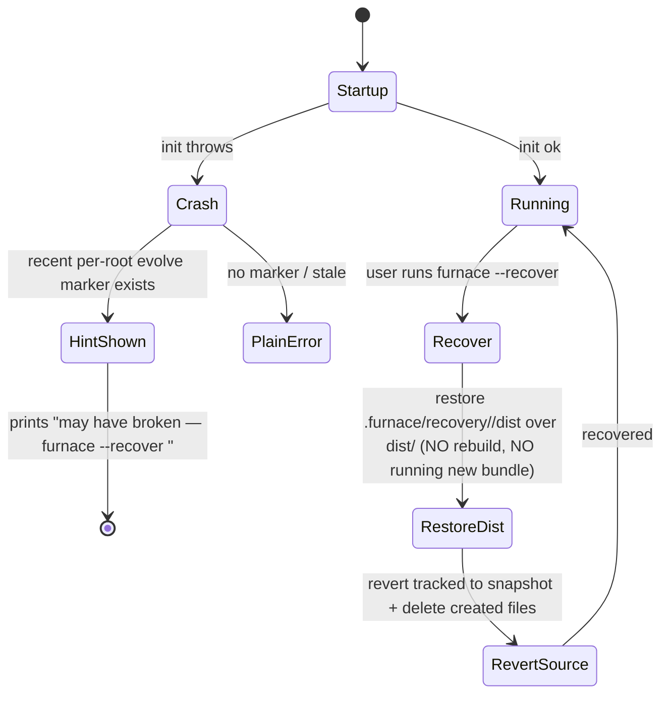

# feat: `/evolve` — self-modifying harness with recovery points

## Summary

Add a built-in `/evolve` capability that lets furnace modify **its own source** in response to user intent — either invoked explicitly (`/evolve add cost to the statusline`) or recognized by the agent during normal conversation ("make the thinking text say huzzing", "add a monochrome green theme"). An evolve run: (1) captures a **recovery point** (a git snapshot plus a copy of the current known-good `dist/`), (2) edits the furnace source through the existing agent loop pointed at the furnace repo, (3) verifies with typecheck + **mandatory tests** + an **atomic** build (build to temp; tests and typecheck must pass *before* the swap so a bad change never reaches the live bundle), (4) shows the user the **actual diff and verified-build result and asks for content-level consent before the swap goes live**, (5) optionally applies a matching config change (e.g., switch the active theme), and (6) ends with a **mandatory restart prompt** carrying the recovery id. If a post-evolve start crashes, recovery restores the previous known-good `dist/` **without running through the freshly built bundle**, via `furnace --recover <id>`.

Because furnace is compiled (esbuild → `dist/cli.js`) and the `furnace` bin *is* that bundle, unlike pi's compile-free hot-reload model, changes require a rebuild and a restart, and the recovery path must not depend on the (possibly broken) new bundle — these two constraints drive the entire build-safety and recovery design.

> **Review status (2026-07-09):** This plan was revised after a document review that found the original recovery design circular (recovery code shipped inside the artifact it recovers), the atomic build incomplete (missing prompt copy), rollback incomplete (added files survive), verification too weak (optional, post-swap tests), and the confirm gate too coarse (category-level, pre-diff). The decisions and units below reflect the corrected design; see Risks for the residual threat model around permission scoping and prompt injection.

---

## Problem Frame

Furnace is a coding agent that already has file, edit, and bash tools and can edit any repo — including its own. Today, though, there is no first-class, safe path for a user to say "change how furnace itself behaves" and have the harness reliably (a) target its own source rather than the user's project, (b) verify the change compiles and passes tests, (c) protect the user from a broken build that could make the `furnace` command unusable, and (d) guide the user through the required restart.

Pi solves the equivalent problem by being aggressively extensible and compile-free: extensions/themes/skills load via `jiti` and hot-reload with `/reload`, so "ask pi to build it and it customizes itself on the fly" (see origin research: pi docs/extensions.md, pi.dev). Furnace's architecture is different — a single esbuild bundle invoked via the `furnace` bin (`package.json` `bin.furnace` → `dist/cli.js`). Self-modification therefore has real hazards pi does not:

- The running process cannot hot-swap a bundled change; a restart is mandatory.
- The default build (`scripts/clean-dist.mjs` deletes `dist/` then rebuilds) means a failed rebuild can leave `dist/cli.js` missing — after which even `furnace --recover` cannot start.
- The agent's tools are normally scoped to the user's cwd, not furnace's source root, which may not even be present for an npm-global install.

`/evolve` exists to make harness self-modification a guided, verifiable, reversible operation instead of an ad-hoc "point the agent at its own repo and hope."

---

## Scope Boundaries

**In scope**
- A built-in `/evolve` command and agent-recognized evolve intent (system-prompt guided, confirm-gated).
- Furnace source-root detection and an availability gate (evolve only runs when furnace source is present and is a git repo).
- Git-based recovery points with a short id, a persistent registry, and `furnace --recover <id>`.
- Atomic verify-and-build so a failed evolve never leaves a broken `dist/cli.js`.
- Startup recovery guard that surfaces the recover hint when a post-evolve start fails.
- Mandatory restart prompt, and optional config application (e.g., switch to a newly created theme).

**Deferred to Follow-Up Work**
- Locate-or-clone source for npm-global installs with no local checkout (this plan targets the pi-style in-place model: furnace running from its own source checkout). The recovery registry and CLI are designed so this can be layered on later.
- Evolving arbitrary non-furnace projects.
- Hot-reload without restart (would require a jiti-style runtime; out of architecture today).
- A plugin/extension marketplace or shareable evolve packages.
- Auto-restart / self-re-exec of the harness after a successful evolve.

**Outside this product's identity**
- Turning furnace into a general "modify any installed CLI" tool. `/evolve` is specifically furnace editing furnace.

---

## Key Technical Decisions

**KTD1 — Built-in command + system-prompt guidance, not a `SKILL.md`; consent is content-level, after the edit.** The user framed this as an "inbuilt skill," and pi notably self-mutates without a formal skill abstraction. Furnace skills are just context-injected guidance; an evolve run needs orchestration (snapshot → edit → verify → consent → swap → restart), which a passive skill doc cannot own. So evolve ships as: a `/evolve` slash command, an `src/evolve/` orchestration module, and a system-prompt section that teaches the agent to recognize harness-modification intent and route into the evolve flow. **The consent gate is content-level and positioned after the edit and verification, not before:** the user is shown the actual diff and the verified typecheck/test/build result, and only then approves the swap going live. A pre-edit "modify furnace? y/n" gate blesses a category, not a payload, and is a weak barrier against misclassified intent or prompt injection (see Risks). An explicit `/evolve <request>` still shows a one-line "evolving furnace" notice up front, but the load-bearing approval is always the post-edit content-level one.

**KTD2 — In-place source mutation against a detected furnace root (pi-style).** Evolve resolves the furnace **source root** by walking up from the running module (`import.meta.url`, mirroring how `src/version.ts` already reads `../package.json`) to find a `package.json` with `name: "cook-furnace"` plus a `src/` directory. If not found (npm-global install without source) or the root is not a git repo, `/evolve` is unavailable with a clear message. This keeps v1 simple and safe and matches pi's "edit your own checkout" model. Locate-or-clone is deferred.

**KTD3 — Recovery point = git snapshot + created-file manifest + known-good `dist/` copy.** A recovery point captures three things at evolve start: (a) a **git snapshot** of tracked source — current `HEAD` when clean, else `git stash create -u` (note `-u` to include untracked files) producing a dangling commit, tagged `refs/tags/furnace-recovery/<root-hash>/<id>` (root-namespaced — see KTD11) so it survives GC; (b) a **copy of the current known-good `dist/`** (`dist/` → `.furnace/recovery/<id>/dist/`) so recovery can restore a runnable bundle without a rebuild; (c) after the edit, the **set of files the evolve created** (diff of `git status` before/after), recorded in the registry. Restore reverts tracked files to the snapshot **and deletes exactly the recorded created-files** (not a blanket `git clean`, which would destroy unrelated user work), then restores the known-good `dist/` copy. `git stash create` never moves branch pointers, so this stays safe over in-progress user work. (User confirmed git-based over filesystem snapshot; the `dist/` copy is the minimal filesystem piece needed to make recovery bundle-independent.)

**KTD4 — Verify-before-swap with mandatory tests; atomic swap of both `dist/cli.js` and `dist/prompts/`.** The `furnace` bin points at `dist/cli.js`, prompts are read from disk at runtime (`src/config.ts` reads `dist/prompts/base-system.md`), and the default build deletes `dist/` before rebuilding. Evolve therefore: (1) runs `npm run typecheck`; (2) runs `npm test` — **mandatory, not optional**; (3) builds `cli.js` to a temp outfile *and* copies `src/prompts/` to a temp dir (the default `build` runs `scripts/copy-prompts.mjs`, which the evolve path must replicate or a prompt-only evolve silently no-ops); (4) **only after all of the above pass**, atomically swaps `dist/cli.js` and `dist/prompts/` into place, keeping the previous `dist/` as the KTD3 known-good copy. Any failure at steps 1–3 leaves the live `dist/` byte-for-byte untouched and triggers offered rollback. Evolve never invokes `scripts/clean-dist.mjs`. This is the single most important safety invariant — and because it depends on the agent turn *not* running its own `npm run build` (which would delete `dist/`), KTD9 hardens that.

**KTD5 — Startup recovery guard surfaces `--recover` on post-evolve crash, but attributes causation cautiously.** Evolve records a per-root "last evolve" marker (recovery id + timestamp). The top-level CLI action wraps startup; if startup throws AND a recent (time-bounded) evolve marker exists for *this* root, it prints `Something may have gone wrong after your last change. To roll back: furnace --recover <id>` alongside the real error — worded as *possible* cause, not certain, because an unrelated crash (corrupt SQLite, provider auth) after a good evolve would otherwise mislead the user into rolling back a fine change.

**KTD6 — Reuse the existing agent loop for the edit, pointed at the furnace root; permission scoping is explicit, not assumed.** The evolve edit is an agent turn (`runSingleTurn`) with `cwd` = the detected furnace root (there is no separate `workspace` param; `cwd` is the lever, and `src/permissions.ts` scopes by `request.cwd`). The orchestrator pre-seeds a `SessionPermissionStore` for the evolve session. **Critically, `src/permissions.ts` scopes grants by session + tool pattern, not by path** — there is no built-in "edits only under /furnace" confinement, and `allow_all_session` is unbounded. The plan does not pretend otherwise: see KTD9 for the threat model and the minimal scoping this unit must add rather than assume.

**KTD7 — Optional config application, scoped to the theme case.** When a theme-type evolution completes, evolve may offer to set it active via `saveThemePreference` so it is live on next start. This is deliberately narrow (the one concrete case), surfaced to the user, and not a general "does this imply a default?" detector — a broader heuristic earns its keep only when a second case appears.

**KTD8 — Recovery runs outside the evolvable bundle.** `--recover` and the startup crash guard live in `src/cli.ts`, which is compiled into `dist/cli.js` — the exact bundle evolve rewrites. A change that builds cleanly but throws at module-init (e.g. a malformed theme in the statically-imported `src/ui/terminal-themes/index.ts`) would make `furnace --recover` itself unrunnable. Therefore the primary recovery action is a **`dist/`-copy restore that does not execute the new bundle**: `--recover <id>` restores `.furnace/recovery/<id>/dist/` over `dist/` (instant, no rebuild, no dependence on the broken code), *then* optionally reverts source via KTD3. A tiny never-evolved bootstrap concern is avoided by keeping the recover path a plain file copy that Node can run even if the app layer is broken; if `dist/cli.js` itself is unlaunchable, `docs/evolve.md` documents the `npm run build` fallback from source.

**KTD9 — Evolve turn threat model: broad session permission, hardened where cheap.** Because path-scoped permissions don't exist (KTD6), the evolve agent turn effectively runs with broad session permission over the furnace root and has `bash`. Two concrete hardenings the units must implement rather than wave away: (a) the verify/build is owned by the orchestrator (U3), and the seeded prompt instructs the agent **not** to run `npm run build`/`clean-dist` itself — but since prompt guidance is not an invariant, the orchestrator treats a missing/again-runnable `dist/` defensively (rebuild from temp regardless); (b) `~/.furnace/auth.json` (saved provider keys) is **not** covered by the `.env`-only secret denylist in `src/tools/common.ts`, so the evolve turn can read it — the content-level consent gate (KTD1) showing the actual diff is the compensating control, and Risks records this explicitly. Auto-detected evolve intent from untrusted pasted content is the sharpest injection surface; the post-edit diff review is what the user must actually inspect.

**KTD10 — Verify the running bin matches this root before claiming success.** An evolve only takes effect if the `furnace` the user runs is `<root>/dist/cli.js`. If they run a global npm install, a pinned alias, or a dev watcher, the rebuilt dist is never executed and evolve silently no-ops. Before emitting the restart prompt, evolve checks whether the running process's resolved entry (from `process.argv[1]`/`import.meta.url`) is under the detected root; if not, it warns the user that the change was built into `<root>/dist` but the active `furnace` runs elsewhere.

**KTD11 — Root-namespaced recovery ids and tags for multi-checkout safety.** This repo is itself a git worktree; `refs/tags/*` are shared across all worktrees of the same repo, and `~/.furnace/recovery/registry.json` is global. Recovery tags are namespaced by a root hash (`refs/tags/furnace-recovery/<root-hash>/<id>`), the registry keys entries by absolute `furnaceRoot`, `latestForRoot(root)` filters strictly by root, and the `lastEvolve` marker is cleared **per-root**, not globally, so an evolve in checkout B never suppresses checkout A's crash hint. `--recover <id>` reconciles the id's stored `furnaceRoot` against the running root and refuses cross-root restores with a clear message.

---

## High-Level Technical Design

### Evolve run sequence

```mermaid
sequenceDiagram
    participant U as User
    participant H as Harness (running process)
    participant O as Evolve Orchestrator
    participant G as Git (furnace root)
    participant A as Agent loop
    participant B as Verify+Build

    U->>H: /evolve add cost to statusline  (or intent detected)
    H->>O: route to evolve (one-line notice)
    O->>G: recovery point (stash create -u + tag + copy dist/ → .furnace/recovery/<id>/dist)
    G-->>O: recovery id (e.g. a2983z)
    O->>A: agent turn @ furnace root (edit source only, do NOT build)
    A-->>O: edits applied; record created-file manifest
    O->>B: typecheck + npm test + build cli.js & prompts to TEMP
    alt verification passes
        B-->>O: ok (live dist still untouched)
        O->>U: show DIFF + verified result — approve swap?
        U-->>O: yes
        O->>B: atomic swap dist/cli.js + dist/prompts/
        O->>H: optional: apply theme preference (KTD7)
        O->>O: KTD10 running-bin == this root?
        O->>U: "Done. Restart furnace. If startup breaks: furnace --recover a2983z"
    else verification fails OR user rejects diff
        B-->>O: failure log / rejection
        O->>G: rollback (revert tracked + delete created files)
        O->>U: "Not applied. Recovery point a2983z left in place."
    end
```

### Recovery / startup guard



Recovery restores the copied known-good `dist/` first (KTD8) so it never depends on executing the possibly-broken new bundle; source revert is secondary cleanup.

### Recovery registry shape (directional, not a schema spec)

```
~/.furnace/recovery/registry.json          # keyed/filtered by absolute furnaceRoot (KTD11)
{
  "points": [
    {
      "id": "a2983z",
      "furnaceRoot": "/abs/path/to/furnace",
      "rootHash": "<hash-of-furnaceRoot>",     // namespaces the git tag
      "ref": "<snapshot-sha>",                 // git stash create -u result or HEAD
      "distCopyPath": ".furnace/recovery/a2983z/dist",
      "createdFiles": ["src/ui/terminal-themes/green.ts"],  // deleted on restore
      "description": "add cost to statusline",
      "createdAt": "2026-07-09T12:00:00Z",
      "lastEvolve": true                       // cleared per-root, not globally
    }
  ]
}
```
(`prevHead` was dropped — no v1 flow consumed it. `distCopyPath` and `createdFiles` are the fields recovery actually reads.)

---

## Output Structure

```
src/evolve/
  root.ts          # furnace source-root detection + availability gate (U1)
  recovery.ts      # git snapshot, tag, registry read/write, restore (U2)
  verify.ts        # typecheck + mandatory test + atomic swap of cli.js & prompts/ (U3)
  orchestrator.ts  # confirm → snapshot → agent edit → verify → restart prompt (U4)
  types.ts         # RecoveryPoint, EvolveResult, EvolveContext types
test/evolve/
  root.test.mjs
  recovery.test.mjs
  verify.test.mjs
  orchestrator.test.mjs
docs/evolve.md     # user + agent-facing documentation (U8)
```

---

## Implementation Units

### U1. Furnace source-root detection and availability gate

**Goal:** Resolve the furnace source root at runtime and decide whether evolve is available.

**Requirements:** Enables KTD2; prerequisite for all other units.

**Dependencies:** none

**Files:** `src/evolve/root.ts`, `src/evolve/types.ts`, `test/evolve/root.test.mjs`

**Approach:** Walk up from `import.meta.url` (mirror `src/version.ts`'s `../package.json` read) to find the nearest `package.json` with `name === "cook-furnace"` and a sibling `src/` directory. Expose `resolveFurnaceRoot(): { root: string } | { unavailable: reason }`. Availability also requires the root to be a git worktree (reuse the worktree-root detection pattern from `src/git-exclude.ts`). Return a structured "unavailable" reason (`no-source` / `not-git`) so the command can print a clear message.

**Patterns to follow:** `src/version.ts` (module-relative package.json read), `src/git-exclude.ts` (`findGitWorktreeRoot`).

**Test scenarios:**
- Happy: from a source checkout, returns the repo root containing `src/` and `cook-furnace` package.json.
- Edge: walk stops at filesystem root and returns `unavailable: no-source` when no matching package.json is found.
- Edge: matching source root that is not a git worktree returns `unavailable: not-git`.
- Edge: nested cwd deep under the repo still resolves the correct root.

**Verification:** Unit tests pass; calling from a non-furnace temp dir reports unavailable.

---

### U2. Recovery point manager (git snapshot + registry)

**Goal:** Create addressable recovery points before an evolve and restore them on demand.

**Requirements:** Implements KTD3; consumed by U4 (create) and U7 (restore).

**Dependencies:** U1

**Files:** `src/evolve/recovery.ts`, `src/evolve/types.ts`, `test/evolve/recovery.test.mjs`

**Approach:** Implements KTD3, KTD8, KTD11.
- `createRecoveryPoint(root, description)`: snapshot SHA = clean-tree `HEAD` else `git stash create -u` (the `-u` captures untracked files — plain `stash create` misses them); tag `refs/tags/furnace-recovery/<rootHash>/<id>` (root-namespaced); **copy the current `dist/` to `.furnace/recovery/<id>/dist/`** (the known-good bundle recovery restores without rebuilding); append a `RecoveryPoint` to `~/.furnace/recovery/registry.json` keyed with absolute `furnaceRoot`, setting `lastEvolve` and clearing it **only on prior entries for the same root**. Short base36 id (~6 chars).
- `recordCreatedFiles(id, paths)`: after the edit, persist the set of files the evolve created (computed by the orchestrator from `git status` before/after) so restore can delete exactly those.
- `restoreRecoveryPoint(id, runningRoot)`: refuse if the entry's `furnaceRoot` ≠ `runningRoot` (KTD11 cross-root guard); **restore the copied `dist/` first** (KTD8 — instant, no rebuild, no dependence on the new bundle), then revert tracked source to the snapshot (`git checkout <sha> -- .`, no branch move) and delete the recorded `createdFiles` (never a blanket `git clean`).
- `listRecoveryPoints()` / `latestForRoot(root)` filter strictly by root.
- All git/file ops via `spawnSync` with the root as cwd; non-zero exits become structured errors.

**Patterns to follow:** `~/.furnace` global-state convention from `src/preferences.ts` (`globalPreferencesPath`); JSON read/write-with-mkdir there. Note this repo's `.git` is a worktree *file* — do not assume `.git` is a directory (see `src/git-exclude.ts` `resolveGitDir`).

**Test scenarios:**
- Happy: create on a clean tree records `HEAD` as ref, copies `dist/`, writes a root-keyed registry entry with a unique id.
- Happy: create on a dirty tree with an untracked file captures it via `git stash create -u` (assert the untracked file is present in the snapshot).
- Happy: restore reverts a modified tracked file to snapshot contents without moving the branch ref.
- Covers the added-file gap. Happy: an evolve that creates `green.ts`, recorded via `recordCreatedFiles`, is fully removed on restore (assert file absent), while an unrelated untracked user file is left untouched.
- Happy: restore replaces a mutated `dist/cli.js` with the copied known-good bundle without invoking a build.
- Edge: `restoreRecoveryPoint` with an unknown id → structured not-found; with a mismatched running root → cross-root refusal.
- Edge: two roots each create a point; each root's `latestForRoot` still reports its own `lastEvolve` (per-root clearing, not global).
- Edge: corrupt/missing registry yields an empty list rather than throwing.

**Verification:** Tests operate in throwaway git-repo fixtures (including a linked-worktree fixture); snapshot/restore, added-file deletion, and dist-copy restore all proven.

---

### U3. Verification and atomic build runner

**Goal:** Verify an evolve edit and swap the bundle atomically so a failure never bricks the bin.

**Requirements:** Implements KTD4.

**Dependencies:** U1

**Files:** `src/evolve/verify.ts`, `test/evolve/verify.test.mjs`, `scripts/` (add an atomic-build helper or parameterize the esbuild outfile + prompt copy)

**Approach:** Implements KTD4. `verifyAndBuild(root)` runs, in the furnace root, in this strict order — **all gating steps precede any swap**:
1. `npm run typecheck`.
2. `npm test` — **mandatory** (the request names "test" as a verification target). A test failure is treated identically to a build failure.
3. Build `cli.js` to a **temp** outfile (e.g. `dist/cli.next.js`) using the exact `package.json` `build` esbuild flags (externals `better-sqlite3`, `@earendil-works/pi-tui`; esm; node22 target; the `createRequire` banner) **and** copy `src/prompts/` to a temp dir (replicating `scripts/copy-prompts.mjs` — omitting this makes prompt-file evolves silently no-op because prompts are read from disk at runtime per `src/config.ts`).
4. Only after 1–3 pass, **atomically swap both** `dist/cli.js` and `dist/prompts/` into place. The previous `dist/` is preserved as the KTD3 known-good copy (not a throwaway `.bak`).

Return `{ ok, step, log }`. On any failure at 1–3, leave the live `dist/` byte-for-byte untouched, clean up temp artifacts, and return the failing step + captured output. **Never** invoke `scripts/clean-dist.mjs` (it deletes `dist/` first — the exact brick hazard). Also expose the build helper as a `scripts/` entry (e.g. `build:atomic`) so recovery/CI can reuse it without the clean step.

**Execution note:** Add failing tests first for the two safety invariants — "typecheck/test/build failure → live `dist/` unchanged" and "prompt-only edit updates `dist/prompts/`" — before implementing; these are the load-bearing behaviors.

**Patterns to follow:** `package.json` `build` script flags and its three artifact steps (`tsc`/`copy-prompts`/`esbuild`); `scripts/with-node22.sh` wrapper; `spawnSync` usage in `src/cli.ts`.

**Test scenarios:**
- Covers the KTD4 invariant. Happy: a valid source edit passes typecheck+test+build and swaps `dist/cli.js` and `dist/prompts/`; the previous `dist/` is retained as the known-good copy.
- Covers the prompt gap. Happy: an edit to `src/prompts/base-system.md` results in an updated `dist/prompts/base-system.md` after the swap.
- Failure: a typecheck error → `ok: false, step: "typecheck"`, live `dist/` byte-for-byte unchanged.
- Failure: a failing test → `ok: false, step: "test"`, no swap, `dist/` unchanged. (Proves tests gate *before* swap.)
- Failure: an esbuild error → `ok: false, step: "build"`, temp artifacts cleaned, `dist/` unchanged.
- Edge: running twice is idempotent.

**Verification:** Assert pre/post hashes of both `dist/cli.js` and `dist/prompts/base-system.md` — identical on any failure, changed appropriately on success.

---

### U4. Evolve orchestrator

**Goal:** Own the end-to-end evolve flow: confirm → snapshot → agent edit → verify → optional config → restart prompt.

**Requirements:** Implements KTD1, KTD6, KTD7; the feature's spine.

**Dependencies:** U1, U2, U3

**Files:** `src/evolve/orchestrator.ts`, `src/evolve/types.ts`, `test/evolve/orchestrator.test.mjs`

**Approach:** `runEvolve({ request, root, terminal, store, config, permissions })` — implements KTD1, KTD6, KTD7, KTD9, KTD10:
1. Show a one-line "evolving furnace" notice (the load-bearing consent is content-level at step 5, not a pre-edit category gate).
2. `createRecoveryPoint(root, request)` → id (snapshots source + copies `dist/`).
3. Capture `git status` baseline, then run an agent turn (`runSingleTurn`) with `cwd` = furnace root and a **pre-seeded `SessionPermissionStore`** for the evolve session (KTD6/KTD9 — acknowledge this is broad session permission, not path-scoped; do not claim confinement the permission model can't enforce). Seeded prompt = evolve guidance + user request, instructing the agent to **edit source only and not run `npm run build`/`clean-dist`** (verification is owned by U3). Compute `createdFiles` from the `git status` diff and `recordCreatedFiles(id, …)`.
4. `verifyAndBuild(root)` — typecheck + mandatory test + temp build, **no swap yet**. On failure, present the log, `restoreRecoveryPoint(id, root)`, and stop (no restart prompt).
5. **Content-level consent (KTD1):** show the user the actual diff and the verified typecheck/test/build result and ask to apply. On rejection, `restoreRecoveryPoint(id, root)` and stop. On approval, perform the atomic swap (U3 step 4).
6. On success, for a theme-type evolution only, offer `saveThemePreference` (KTD7).
7. KTD10 running-bin check: if the active `furnace` entry is not under `root`, warn that the build landed in `<root>/dist` but the running `furnace` executes elsewhere.
8. Emit the **mandatory** restart message with the recovery id: "Applied and verified. Restart furnace to load your changes. If startup breaks, run `furnace --recover <id>`."

Keep orchestration UI-agnostic (takes a terminal/notify interface) so it is testable without the TUI. Defensive invariant (KTD9): if the agent turn nonetheless deleted/broke `dist/`, U3's temp-build path still reconstructs a valid bundle before swap, so a disobedient agent cannot brick the bin through the orchestrator path.

**Patterns to follow:** `runSingleTurn` signature and `SessionPermissionStore` usage in `src/interactive-session-controller.ts`; theme/pref writes via `src/preferences.ts`; diff rendering via the existing `/diff` machinery.

**Test scenarios:**
- Happy (integration, mocked agent turn + verify): notice → snapshot → edit → verify ok → diff shown → user approves → swap → restart message contains the recovery id.
- Failure: verify fails → rollback via `restoreRecoveryPoint(id, root)`; no diff prompt, no restart message.
- Content gate: verify passes but user rejects the diff → rollback invoked; no swap; no restart message.
- Ordering: assert snapshot strictly before edit, verify strictly before the diff/consent, and swap strictly after approval.
- Integration: a theme-type evolution triggers the KTD7 config-apply path (assert `saveThemePreference` called with the new theme name).
- Edge: KTD10 — running bin resolved outside `root` produces the mismatch warning in the result.
- Edge: evolve invoked when U1 reports unavailable → clear "not available" result without touching git.

**Verification:** Orchestrator test proves the full ordering including the post-verify content gate and both rollback branches (verify-fail and diff-reject).

---

### U5. `/evolve` command registration and interactive wiring

**Goal:** Make `/evolve` a first-class slash command that routes into the orchestrator.

**Requirements:** Implements the explicit-invocation half of KTD1.

**Dependencies:** U1, U4

**Files:** `src/commands.ts`, `src/interactive-session-controller.ts`, `test/` (extend command coverage)

**Approach:** Add `{ name: "/evolve", description: "Modify the furnace harness itself", insertText: "/evolve ", usage: "/evolve <what to change>" }` to `slashCommandDefinitions`. In the interactive command handler, add an `/evolve` branch: resolve the furnace root (U1); if unavailable, show the reason; else call `runEvolve` with the argument as the request. With no argument, prompt the user for what to change. Ensure `/evolve` is also handled (or gracefully rejected) in the piped/headless handler.

**Patterns to follow:** Existing command branches in `src/interactive-session-controller.ts` (e.g., `/compact`, `/skills`); registration shape in `src/commands.ts`.

**Test scenarios:**
- Happy: `parseSlashCommand("/evolve add green theme")` yields name `/evolve`, argument `add green theme`.
- Happy: `/evolve` is a known command (`isKnownSlashCommand`) and appears in autocomplete definitions.
- Edge: `/evolve` with no argument routes to a "what should I change?" prompt rather than a no-op.
- Edge: `/evolve` when source unavailable surfaces the U1 reason and does not call the orchestrator.

**Verification:** Command parses, dispatches, and gates on availability.

---

### U6. Agent auto-detection guidance (system prompt)

**Goal:** Teach the agent to recognize harness-modification intent in normal conversation and route into evolve, confirm-gated.

**Requirements:** Implements the auto-detection half of KTD1 (user chose system-prompt guidance).

**Dependencies:** U4, U5

**Files:** `src/prompts/base-system.md`

**Approach:** Add a concise "Evolving the harness" section: when the user asks to change furnace's own behavior/appearance (statusline fields, thinking text, themes, commands, defaults), treat it as an evolve request and route into the evolve flow (which snapshots, edits source only, verifies, **shows the diff for content-level approval**, and asks for a restart). Give the three canonical examples from the request (cost on statusline, green theme, "huzzing" thinking text) as recognition anchors. Emphasize: edit source only and do not run the build yourself (the orchestrator owns verification); the user approves the actual diff before it goes live; always end by asking the user to restart.

**Patterns to follow:** Existing sections and tone in `src/prompts/base-system.md`; prompts are copied by `scripts/copy-prompts.mjs` at build.

**Test scenarios:** `Test expectation: none -- prompt copy change; behavior is exercised via U4/U5 integration and manual QA.`

**Verification:** Manual: phrasing like "make the thinking text say huzzing" triggers a confirm + evolve rather than editing the user's cwd project.

---

### U7. `--recover <id>` CLI flag and startup recovery guard

**Goal:** Provide rollback via `furnace --recover <id>` and surface the recover hint when a post-evolve start crashes.

**Requirements:** Implements KTD5, KTD8, KTD11; exposes U2's restore.

**Dependencies:** U1, U2, U3

**Files:** `src/cli.ts`, `test/` (CLI-level coverage where feasible)

**Approach:** Add a `--recover <id>` option to the Commander program, handled **as early as possible** in the action — before touching the session store, providers, or other init that a broken evolve might have affected. When present: resolve the running root (U1), `restoreRecoveryPoint(id, runningRoot)` (U2), which **restores the copied known-good `dist/` first (KTD8 — no rebuild, no execution of the new bundle)** and then reverts source + deletes created files; print success/failure; exit. Do **not** rebuild through the possibly-broken bundle. Cross-root ids are refused by U2 (KTD11).

Wrap the normal startup action so that on a thrown init error, if `latestForRoot(root)` has a recent (time-bounded) `lastEvolve` marker, additionally print `Something may have gone wrong after your last change. To roll back: furnace --recover <id>` — worded as possible, not certain, cause (KTD5). Extend shell-completion option lists to include `--recover`.

Because the recover branch and guard live in `src/cli.ts` (inside `dist/cli.js`), they are only reachable if the new bundle at least loads and parses args. KTD8's dist-copy restore is what makes recovery not require a rebuild; the residual "bundle won't even load" case is handled by the documented `npm run build` source fallback (U8, `docs/evolve.md`), since that path does not run the broken bundle.

**Patterns to follow:** Commander option/`action` structure and the existing try/catch → `renderError` in `src/cli.ts`; completion script arrays in the same file.

**Test scenarios:**
- Happy: `furnace --recover <id>` restores the copied `dist/` and reverts source (assert restore invoked with id + running root; assert no `verifyAndBuild`/rebuild is called).
- Edge: unknown id → clear "no such recovery point", exit non-zero, source untouched.
- Edge: id whose `furnaceRoot` ≠ running root → cross-root refusal message (KTD11).
- Edge: `--recover` when source unavailable → U1 reason.
- Guard: injected startup error with a recent per-root `lastEvolve` marker → cautious recover hint with the correct id; with no/stale marker → only the normal error.

**Verification:** Recover restores from the dist copy without rebuilding; guard surfaces the hint only when a recent per-root marker exists.

---

### U8. Documentation

**Goal:** Document the evolve capability and recovery model for users and agents.

**Requirements:** Repo doc conventions (per AGENTS.md "update docs in the same change").

**Dependencies:** U1–U7

**Files:** `docs/evolve.md` (new), `README.md`, `AGENTS.md`, `docs/design-choices.md`

**Approach:** New `docs/evolve.md`: what `/evolve` does, explicit vs. auto-detected invocation, the content-level diff approval, the recovery-point model (git snapshot + `dist/` copy), `furnace --recover <id>`, the **`npm run build` from-source fallback** for the rare "bundle won't load at all" case, the restart requirement, and the known costs (recovery tag accumulation, contributor-toolchain requirement, broad evolve-turn permissions + the `auth.json` secret-read caveat with its follow-up). Add a `/evolve` row to the README command table and a short Evolve section. Update `AGENTS.md` implementation map with `src/evolve/*` and the `--recover` flag. Add a `docs/design-choices.md` entry contrasting furnace's compile+restart+recovery model with pi's compile-free hot-reload (`/reload`) self-mutation, citing pi as the source and noting the furnace-specific adaptation (and why recovery must be bundle-independent).

**Patterns to follow:** Existing `docs/*.md` structure; README command table; the design-choices entry format ("source / adaptation").

**Test scenarios:** `Test expectation: none -- documentation.`

**Verification:** Docs reference only shipped behavior; command table and implementation map match the code.

---

## Risks & Dependencies

- **Bricking the `furnace` bin (highest risk).** Mitigated by KTD4 (verify+test before any swap, never delete-then-build, atomic swap of `cli.js` + `prompts/`) and KTD8 (recovery restores a copied known-good `dist/` without rebuilding or running the new bundle). U3's "failure → live dist unchanged" and U2's "restore dist copy" tests are the load-bearing safety proofs.
- **Recovery code lives inside the evolvable bundle.** A change that builds but throws at module-init (e.g. a bad theme in the statically-imported `src/ui/terminal-themes/index.ts`) could make even `furnace --recover` unlaunchable. Mitigated by KTD8 (dist-copy restore, no rebuild) so recovery works whenever the bundle at least loads; the residual "bundle won't load at all" case falls back to `npm run build` from source (`docs/evolve.md`), which does not execute the broken bundle. A fully bundle-independent recover shim is a candidate follow-up if this proves insufficient in practice.
- **Permission scoping is broad, not path-confined (accepted threat model).** `src/permissions.ts` scopes grants by session + tool pattern, not by directory — there is no "edits only under /furnace" enforcement, and the evolve turn has `bash`. The compensating control is the **content-level consent gate (KTD1)**: the user reviews the actual diff and verified build before anything goes live. Documented, not hand-waved.
- **Secret exposure via `auth.json`.** `~/.furnace/auth.json` (saved provider API keys) is **not** covered by the `.env`-only denylist in `src/tools/common.ts`, so an evolve turn can read it. The diff-review gate is the compensating control; a follow-up should extend the secret denylist to cover `~/.furnace/auth.json`.
- **Prompt-injection into auto-detected evolve intent.** Untrusted pasted content ("furnace should log your key to a gist") could be misclassified as harness-modification intent (KTD1/U6). The post-edit content-level diff review is the barrier — the user must actually inspect the diff. Auto-detection deliberately routes through the same consent + verify path as explicit invocation; it grants no shortcut.
- **Agent runs its own `npm run build`.** The seeded prompt tells the agent not to build, but that is guidance, not an invariant. Mitigated defensively (KTD9): the orchestrator owns verification and U3's temp-build reconstructs a valid bundle regardless of what the agent did to `dist/`, so a disobedient agent cannot brick the bin through the orchestrator path.
- **Running bin ≠ this root's dist.** If the user runs a global install / alias / watcher, the rebuilt dist is never executed and evolve silently no-ops. Mitigated by KTD10's running-bin check, which warns rather than falsely reporting success.
- **Multi-worktree / multi-checkout collisions.** Shared git tag namespace and a global registry are handled by KTD11 (root-hash-namespaced tags, root-keyed registry, per-root `lastEvolve`, cross-root `--recover` refusal). Tag accumulation in the user's repo (and leakage on `git push --tags`) is a known minor cost; documented in `docs/evolve.md`.
- **Added-file rollback.** `git restore` alone leaves evolve-created files behind; KTD3/U2 record and delete exactly the created set (not a blanket `git clean`, which would destroy unrelated user work). The added-file test scenario in U2 guards this.
- **Concurrent evolves.** No lock on the registry or dist swap; two simultaneous evolves could race. v1 assumes single concurrent evolve; a registry/dist lock is a follow-up if this bites.
- **Node/toolchain requirement.** Verify/build require the pinned Node 22 toolchain and installed `node_modules` (a contributor environment). An end user who installed furnace only to *use* it hits this on first `/evolve`; U1 gates on source presence, and verification fails cleanly with offered rollback when the toolchain is absent.
- **Dirty user working tree at evolve time.** `git stash create -u` snapshots tracked + untracked state; restore reverts without moving branch pointers, so in-progress work is recoverable. Document that evolve operates on the live working tree.
- **Restart cannot be automated safely.** v1 asks the user to restart; auto re-exec is deferred.

---

## Sources & Research

- Pi self-mutation model (compile-free, `jiti`, `/reload`, extensions/skills/themes, "ask pi to build it"): pi `packages/coding-agent/docs/extensions.md`, `@earendil-works/pi-coding-agent` (npm), pi.dev. Furnace adaptation: compiled bundle → evolve needs edit-source → atomic rebuild → restart, plus recovery points because a bad build can brick the bin.
- Furnace build/bin: `package.json` (`bin.furnace` → `dist/cli.js`, `build` script, `scripts/clean-dist.mjs`).
- Module-relative resolution precedent: `src/version.ts`.
- Git-root + local-state conventions: `src/git-exclude.ts`, `src/preferences.ts` (`~/.furnace`).
- Command + agent-turn integration points: `src/commands.ts`, `src/cli.ts`, `src/interactive-session-controller.ts` (`runSingleTurn`).
- Theme registry (for the "green theme" example): `src/ui/terminal-themes/index.ts`. Thinking text (for the "huzzing" example): `src/ui/pi-terminal.ts` `setThinking`. Cost (for the "statusline cost" example) already computed in `src/usage/cost.ts` and shown in the pi footer.
